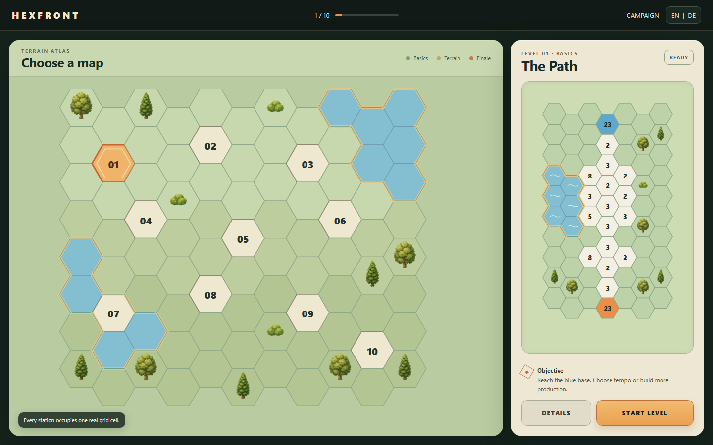
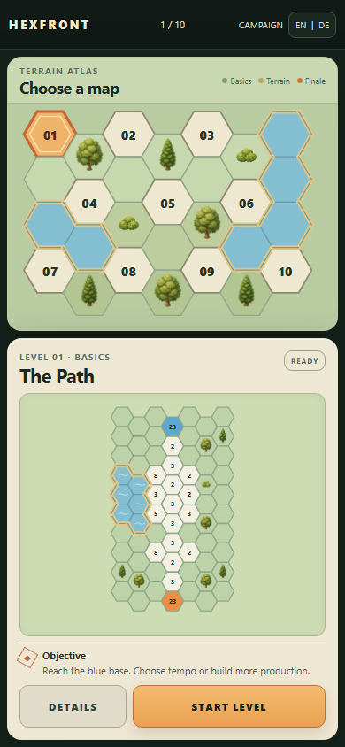

# HEXFRONT

[](https://github.com/emfau88/hexwars/actions/workflows/pages.yml)

HEXFRONT is a compact real-time territory-tactics game for desktop browsers and mobile portrait screens. Send forces between hex fields, grow a connected territory, keep the active edge supplied and capture the rival base across a ten-level campaign.

> **Project status:** the campaign architecture and core-gameplay refactor are complete. The project is an internal vertical slice, not yet a commercially finished release. `HEXFRONT` remains a working title; product naming, the shared menu/board visual identity, English/German localization and human playtest validation are still open.

## Current visual direction

The current campaign-menu candidate is **Terrain Atlas V2**. It is a review mockup, not yet part of the production game.

| Desktop · 1440 × 900 | Mobile portrait · 390 × 844 |
|---|---|
|  |  |

Its defining rule is grid-first construction: one mathematically consistent hex grid is created before terrain, water, vegetation and level stations fill individual cells. Stations never overlay a second grid, shorelines exist only on valid water/land boundaries, and mobile uses a dedicated reflow rather than a compressed desktop layout. See the [V2 design notes and deterministic mockup source](./docs/mockups/terrain-atlas-v2/README.md). Earlier explored directions remain available in the [campaign-menu mockup archive](./docs/mockups/campaign-menu-directions/README.md).

## Play

- [Open the current GitHub Pages build](https://emfau88.github.io/hexwars/)
- Desktop: drag from one of your numbered fields to a reachable field.
- Mobile: use the same direct drag gesture in portrait orientation.
- `50%` keeps a reserve; later levels unlock full and grouped sends.
- Connected rear fields retain a configurable garrison and physically route surplus toward the active edge. Supply never attacks automatically.
- From Level 6 onward, tap an owned edge field to prioritize its supply. Drag directly between connected owned fields for manual long-range reinforcement.

## Current campaign

- Ten deterministic, declarative levels with sequential progression and persistent local saves.
- Terrain, relay, multi-lane and grouped-send concepts introduced progressively.
- Symmetric neutral strengths on symmetric maps to avoid hidden seeded side advantages.
- Rebuilt Level 1: one early tempo-versus-production decision using only the 50% send.
- Level 2 makes the 100% send a real breakthrough-versus-reserve trade-off.
- Symmetric late-match growth decline after 180 seconds and growth stop after 240 seconds.
- Visible movement, combat, capture, supply-route and supply-focus feedback.

## Quality status

The current release gates run locally and in the GitHub Pages workflow:

```bash
npm run typecheck
npm test
npm run test:browser
npm run balance
npm run build
```

Current automated baseline:

- 31 unit, simulation, level, persistence and Supply A–G tests;
- 10 Playwright flows across desktop Chromium and mobile portrait;
- real pointer-drag input, regular base capture, AI action, victory and persisted unlock coverage;
- long-range reinforcement and contextual supply-focus coverage through canvas input;
- all ten campaign levels started and validated in both supported viewport classes;
- responsive overflow and 44 × 44 px minimum touch-target guards;
- deterministic balance report for all ten levels.

The deterministic balance agent is a regression instrument, not a substitute for human playtests. Level 1 pacing and Levels 6/8 remain the first human-validation priorities.

## Local development

Requires Node.js 20 or newer.

```bash
npm install
npm run dev
```

Open the Vite URL shown in the terminal. `npm run test:browser` builds and serves the production bundle automatically.

## Architecture

HEXFRONT uses Vite, strict TypeScript, ES modules and Canvas 2D.

```text
src/
├─ app/          application lifecycle
├─ core/         state, types, configuration and deterministic random
├─ levels/       ten declarative level definitions
├─ systems/      growth, movement, combat, AI, supply and victory
├─ input/        pointer interpretation and gameplay commands
├─ rendering/    board, landscape and effects
├─ ui/           campaign and in-match DOM interface
├─ audio/        sound and haptic boundary
├─ persistence/  campaign save and settings
└─ debug/        narrow test/debug API
```

Simulation rules do not depend on the DOM or Canvas. Rendering does not decide ownership, growth or combat. The controlled `window.__HEXFRONT__` boundary supports state inspection but does not replace real-input browser tests.

The former turn-based prototype is preserved under [`legacy/tactics`](./legacy/tactics). It is excluded from the current build and has no runtime, state or save dependency on HEXFRONT.

## Next product gates

The highest-value next step is not adding more mechanics. It is approving one shared visual language for the campaign overview and the playable board.

1. Resolve the product name, promise and nonmilitary English/German terminology.
2. Approve or revise Terrain Atlas V2 as the shared campaign/board direction.
3. Approve one shared token system for color, typography, spacing, borders, shore treatment and surface treatment before changing production UI.
4. Implement the persistent English-default `EN | DE` localization system.
5. Complete first-session tap/keyboard onboarding and accessibility equivalents.
6. Human-test and finish Levels 1–3 as the public vertical slice, then validate Levels 4–10.

See the full [prioritized product roadmap](./docs/campaign-roadmap.md), the [professional audit](./docs/campaign-audit.md), the [completed restructuring brief](./docs/auftrag-hexfront-neustrukturierung.md), the [migration baseline](./docs/campaign-migration-baseline.md) and the [balance report](./docs/campaign-balance-report.md).

## Scope discipline

The current direction deliberately avoids a genre pivot, 3D, an engine migration, buildings, spells, tech trees, unit rosters, global supply resources and automated player attacks. Complexity should come from map geometry, timing, allocation and commitment—not from additional menus or routine clicks.
