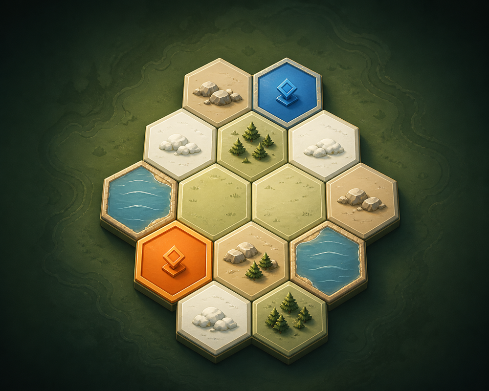
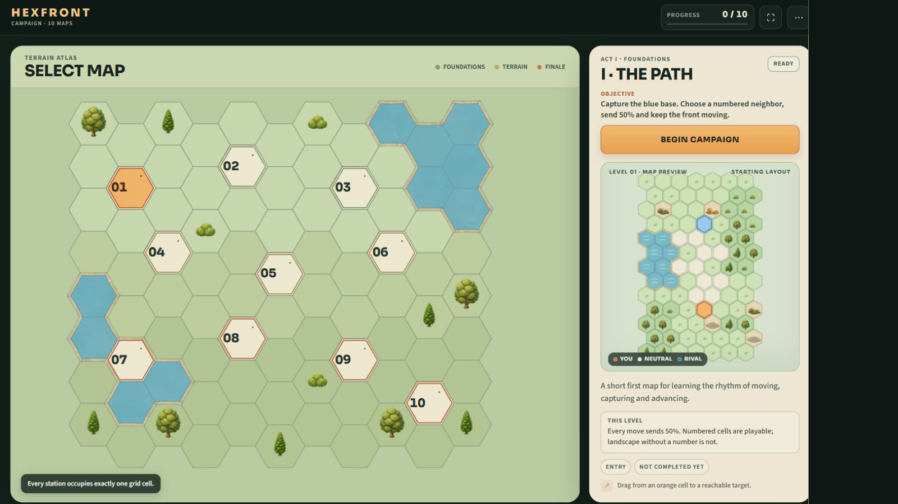
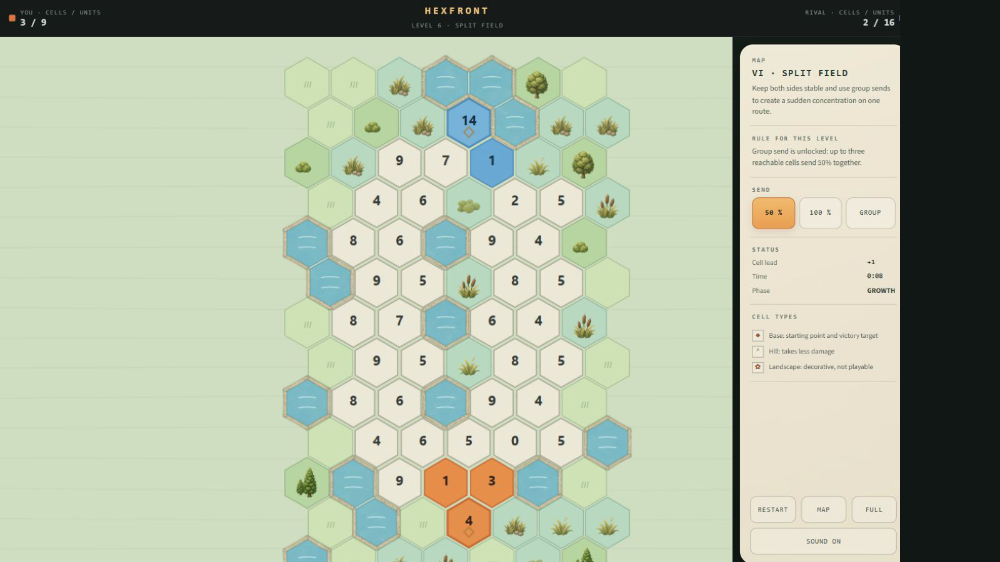
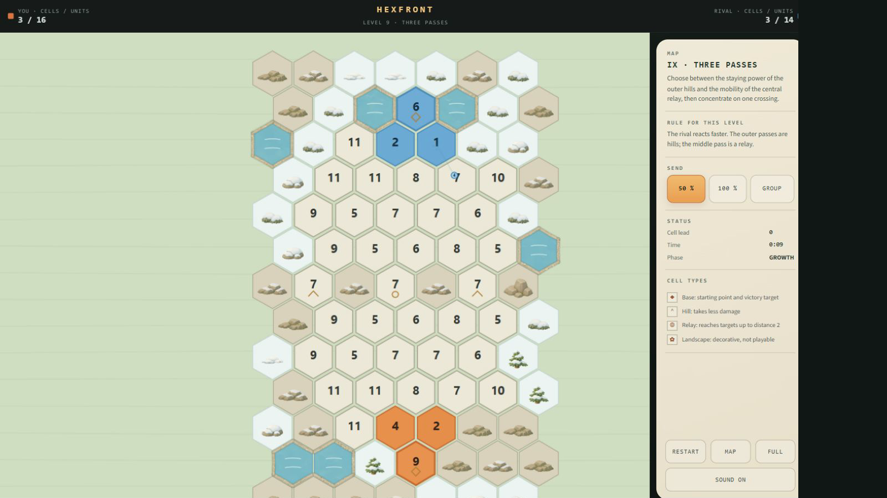

# HEXFRONT

[](https://github.com/emfau88/hexwars/actions/workflows/pages.yml)

HEXFRONT is a compact real-time tactics game for desktop browsers and mobile portrait screens. Expand across a hex grid, distribute growing forces and capture the opposing base.

<p align="center">
  
</p>

## Current screenshots

### Campaign atlas



<table>
  <tr>
    <th>VI · Split Field</th>
    <th>IX · Three Passes</th>
  </tr>
  <tr>
    <td width="50%"></td>
    <td width="50%"></td>
  </tr>
</table>

The upload-ready portal package contains one 1000 × 800 icon and three 1600 × 900 English screenshots in [`docs/portal/kongregate`](./docs/portal/kongregate/README.md).

## Play

[Play the current GitHub Pages build](https://emfau88.github.io/hexwars/)

- Drag from an orange field to a reachable target.
- `50%` sends half of the available force and keeps a reserve.
- Later levels unlock full sends, grouped sends and manual reinforcement.
- Capture the blue base to win the mission.

## Current state

HEXFRONT is a public, playable vertical slice and browser-portal release candidate with a production-safe build and upload artwork. It is not yet a finished commercial release.

- Ten deterministic campaign levels with sequential unlocks and best-time persistence
- Real-time AI, combat, supply, reinforcement and visible endgame systems
- Production terrain-atlas campaign menu with responsive mission dossiers and map previews
- Desktop and mobile-portrait layouts with mouse, touch-drag and fullscreen support
- English by default with a persistent in-game `EN | DE` switch
- Campaign-aligned victory, defeat, retry and next-mission flows
- Connected water and shore rendering plus a restrained 16-asset environment set
- Compact CC0 sound palette for commands, UI, captures and results with a persistent in-game sound toggle
- 43 logic, simulation, localization and regression tests
- Playwright coverage for wide desktop, compact 1100 × 700 desktop and mobile campaign behavior
- Deterministic ten-level balance smoke test

The default `decor-v2` presentation uses mountains, marsh vegetation, snow and natural ground accents. The former lock-like ruin motifs have been replaced by mushrooms, low bedrock, fern/moss and dry grass/fieldstone details without increasing decoration density.

Production builds ignore development query parameters and do not expose the `window.__HEXFRONT__` inspection API. Development and automated-test builds retain those tools for balancing, visual review and browser automation.

Before a commercial release, the remaining priorities are human playtesting and balance evidence, keyboard/tap accessibility, a commercially cleared product name, final audio mix validation on physical devices and validation inside the target distribution portal.

## Local development

Requires Node.js 20 or newer.

```bash
npm install
npm run dev
```

Quality checks:

```bash
npm run typecheck
npm test
npm run test:browser
npm run balance
npm run verify:production
```

`npm run dev` exposes development-only inspection and review tools. `npm run verify:production` creates the player-facing release build and fails if a development entry point leaked into it; the browser suite builds in an isolated test mode so it can exercise the same diagnostics without publishing them.

## Documentation

- [Product and game-design audit](./docs/campaign-audit.md)
- [Prioritized roadmap](./docs/campaign-roadmap.md)
- [Campaign balance report](./docs/campaign-balance-report.md)
- [Localization guide for future EN/DE content](./docs/localization-guide.md)
- [Audio sources and licenses](./public/assets/audio/ATTRIBUTION.md)
- [Completed restructuring brief](./docs/auftrag-hexfront-neustrukturierung.md)
- [Visual design references](./docs/mockups/)

The former turn-based prototype is preserved under [`legacy/tactics`](./legacy/tactics) and is not part of the current runtime.
