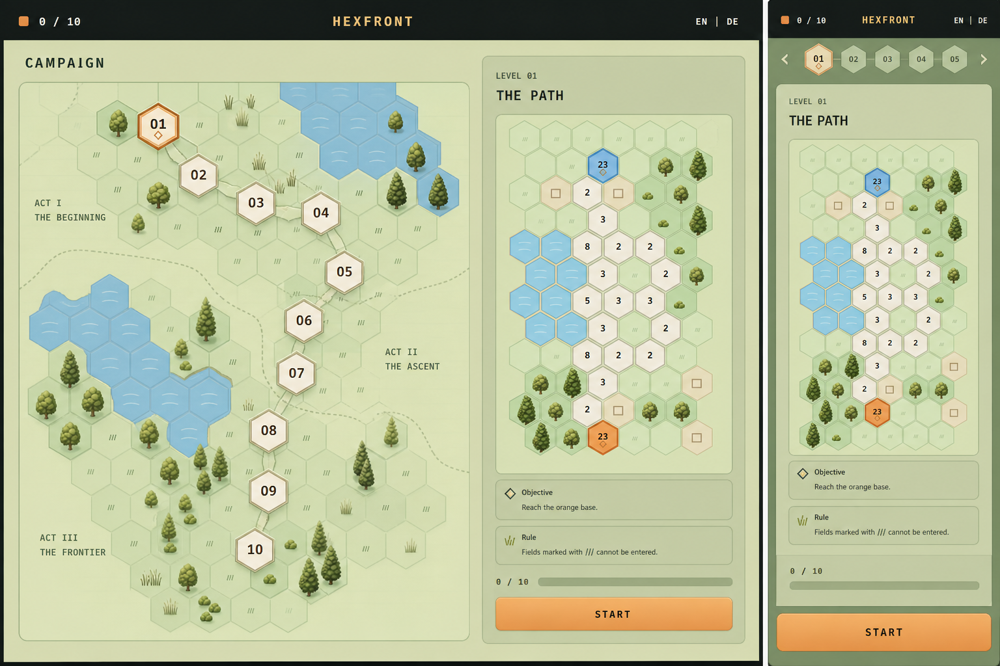
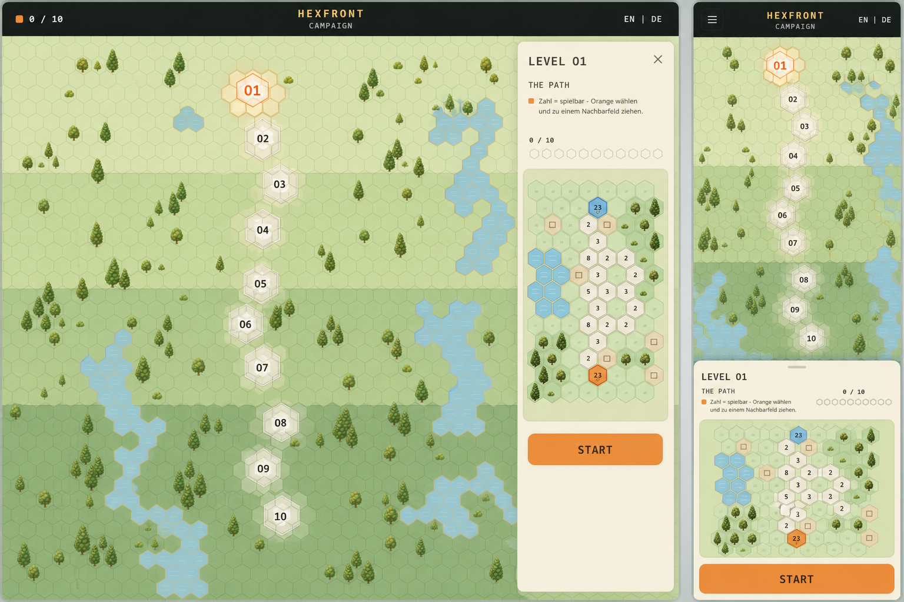
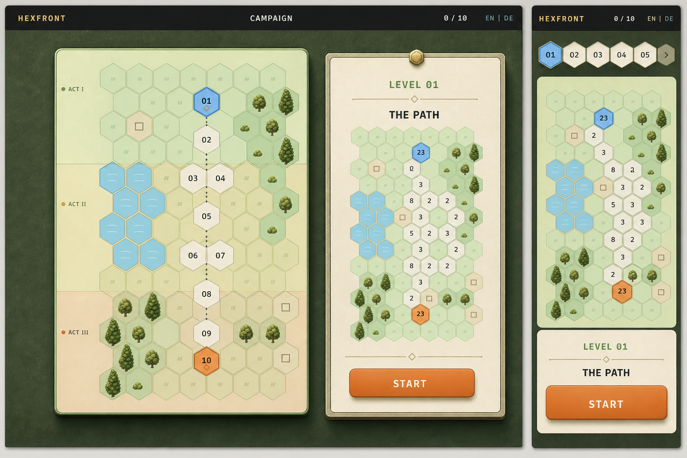

# Campaign menu directions — desktop/mobile pairs

Created on 12 August 2026 as visual decision material. These are exploratory raster mockups, not production UI and not a copy/layout specification. Small generated labels are provisional; the decision concerns composition, surfaces, hierarchy, typography direction and the relationship between campaign menu and board.

## Shared brief

- Use the current Level 1 desktop/mobile board as the visual identity reference.
- Keep the complete board visibly constructed from hexes.
- Preserve pale sage terrain, warm cream neutral cells, orange player state and blue rival state.
- Treat connected water as one body through coherent shore transitions while keeping individual hex boundaries readable.
- Vary vegetation with restrained deciduous trees, conifers, small trees, bushes, reeds and grass.
- Use one responsive system for desktop and mobile; the compact route must be immediately reachable on mobile.
- Avoid fantasy parchment, medieval cartography, military command tables, radar/control-room UI, white productivity-app styling and hidden hex grids.
- English is the source-language direction; `EN | DE` is visible as the future persistent language control.

## 1. Terrain Atlas — recommended starting direction

Prompt direction: place a clearly visible hex campaign route and a large real board preview on one pale-sage terrain surface, framed by a restrained dark-moss product shell. Replace the current card dashboard with route, map and one integrated dossier. Use humanist sans-serif typography and reserve monospace for numeric values.

Strengths:

- strongest balance of game identity, clarity and realistic implementation scope;
- keeps map preview, route and mission information readable at once;
- retains calm landscape without making the entire background interactive-looking;
- easiest direction to translate into the existing DOM/CSS architecture.

Risk:

- requires careful contrast tuning so the large light terrain surface does not become pale or office-like.

## 2. Living Hex Map

Prompt direction: make the campaign overview a zoomed-out version of the same living hex world as gameplay. Integrate Levels 01–10 directly into three subtle biome bands and show the selected mission in a lightweight side sheet on desktop or bottom sheet on mobile.

Strengths:

- strongest possible visual continuity between menu and play;
- campaign progress feels spatial and memorable;
- most potential for authored biome identity and landmarks.

Risks:

- highest density and production cost;
- large visible-hex background can compete with the actual route, especially on mobile;
- needs strict restraint to prevent decorative cells from reading as playable campaign nodes.

## 3. Modern Tabletop

Prompt direction: present the campaign route and selected map as two premium modern board-game components on a deep-moss surface. Keep tactile depth subtle, use the real hex board as the main material language and avoid both command-center panels and fantasy props.

Strengths:

- premium, calm and highly legible;
- strongest separation of route and mission dossier;
- mobile stacking is straightforward and robust.

Risks:

- can imply a physical board game more strongly than the live territory-flow experience;
- cream folio and drop shadows can drift toward decorative tabletop theming if overdone;
- less immediate environmental continuity than the Living Hex Map.

## Recommendation

Use **Terrain Atlas** as the base system, then borrow two controlled ideas:

- from Living Hex Map: subtle biome bands and a spatial journey;
- from Modern Tabletop: tactile but restrained panel edges and strong mobile stacking.

Do not combine all three literally. The production direction should remain Terrain Atlas with only those two accents, otherwise the interface will become visually busy again.

## Source references

- [Current Level 1 — desktop](./reference-current-level1-desktop.png)
- [Current Level 1 — mobile portrait](./reference-current-level1-mobile.png)
